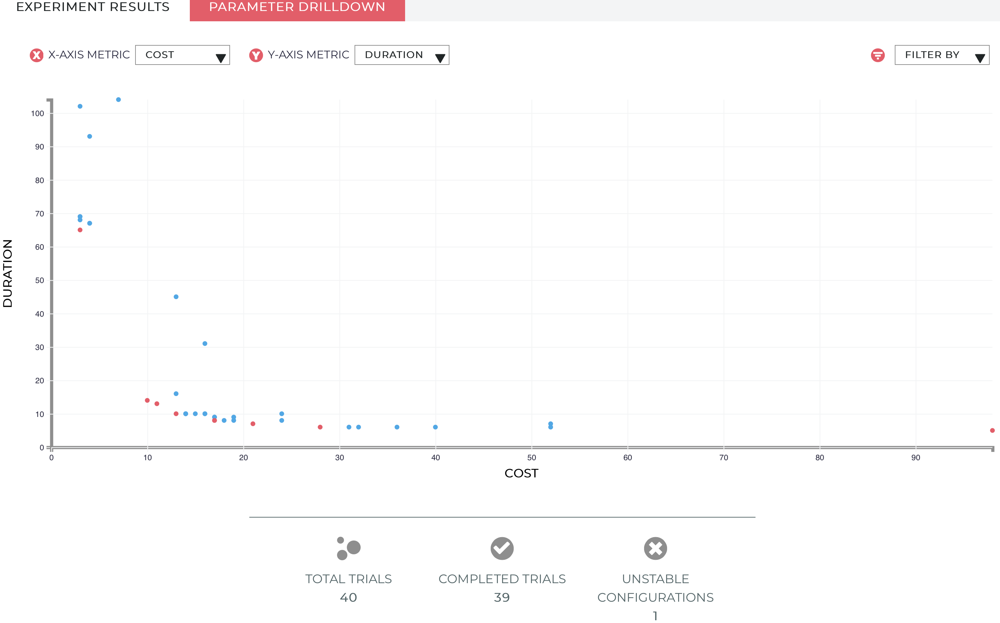

# Postgres

The purpose of this guide is to get you started with Red Sky Ops and Postgres.
We will cover
- Deploying a postgres to Kubernetes
- Exploring the postgres experiment
- Running trials to determine the best configuration

## Prerequisites

- Kubernetes cluster
  - A typical [minikube][minikube] cluster will be sufficient. The experiment may consume up to 4vcpu and 4GB memory
- [kubectl][kubectl] properly configured for your cluster
- [redskyctl][redskyctl]
- [kustomize][kustomize] v3.1.0+
- [Red Sky Ops Account][rso account]

## Initialize the Red Sky Ops Manager

Log in to your Red Sky Ops account:
```sh
$ redskyctl login
Opening your default browser to visit:

	https://auth.carbonrelay.io/authorize?...

You are now logged in.
```

When you initialize your cluster for Red Sky Ops, the following resources will be created:
- `redsky-system` namespace
- `experiment` and `trial` custom resource definitions
- `ClusterRole` and `ClusterRoleBinding` for the controller service account
- controller deployment
- an authorization secret for the controller
Initialize your cluster with the following command:

```sh
$ redskyctl init --wait
namespace/redsky-system created
customresourcedefinition.apiextensions.k8s.io/experiments.redskyops.dev created
customresourcedefinition.apiextensions.k8s.io/trials.redskyops.dev created
clusterrole.rbac.authorization.k8s.io/redsky-manager-role created
clusterrolebinding.rbac.authorization.k8s.io/redsky-manager-rolebinding created
deployment.apps/redsky-controller-manager created
clusterrole.rbac.authorization.k8s.io/redsky-patching-role created
clusterrolebinding.rbac.authorization.k8s.io/redsky-patching-rolebinding created
secret/redsky-manager created
```

Verify manager is running:

```sh
$ kubectl wait --for condition=Ready=true po \
  -n redsky-system \
  -l app.kubernetes.io/name=redskyops
pod/redsky-controller-manager-5fb9f4cd4d-g2rn5 condition met
```

## Create the Experiment

We'll use the Postgres example [here][postgres-example].
This example will deploy the postgres application and configure an experiment to tune the memory and cpu limits for postgres.
The controller will schedule trials ( Kubernetes jobs ) using `pgbench` to generate load against our postgres instance.
Each trial will test a different set of parameters provided by the Red Sky Ops machine learning(ML) servers.
The effectiveness of each trial is gauged by the metrics, in this case we contrast cost versus duration.

Deploy the postgres application and experiment using the following:
```sh
$ kustomize build github.com/redskyops/redskyops-recipes/postgres | \
  kubectl apply -f -
secret/postgres-secret created
service/postgres created
deployment.apps/postgres created
experiment.redskyops.dev/postgres-example created
```

You can monitor the progress using `kubectl`:

```sh
$ watch -d kubectl get trials -o wide
Every 2.0s: kubectl get trial -o wide

NAME                        STATUS      ASSIGNMENTS             VALUES
postgres-example-000   Completed   cpu=1319, memory=1457   duration=7, cost=33
postgres-example-001   Completed   cpu=963, memory=2647    duration=5, cost=29
postgres-example-002   Completed   cpu=2394, memory=1934   duration=5, cost=58
postgres-example-003   Completed   cpu=3508, memory=2654   duration=6, cost=85
postgres-example-004   Completed   cpu=3410, memory=1019   duration=5, cost=78
postgres-example-005   Completed   cpu=2757, memory=2538   duration=4, cost=68
postgres-example-006   Completed   cpu=983, memory=3057    duration=6, cost=30
postgres-example-007   Completed   cpu=373, memory=3065    duration=15, cost=17
postgres-example-008   Waiting     cpu=1198, memory=2701
```

The trials will run until the `experimentBudget` is satisfied. In this example, there will be 40 trials that run.
While the trial is running, there may be assignment combinations that are unstable and result in a failure.

After the trial is complete, you will be able to view the parameters and the metrics generated from the trial.
The results can be reviewed as a visualization by running the following command:

```sh
$ redskyctl results
```

This should open a link in your browser showing a graph similar to the below.


This is where you can review the trials that have taken place and decide which parameter makes the most appropriate trade-off.
There is a filter on the upper right hand side where you can display trials that were labeled `best` to better narrow down your results.

## Removing the Experiment

To clean up the data from your experiment, simply delete the experiment. The delete will cascade to the associated trials and other Kubernetes objects:

```sh
$ kustomize build github.com/redskyops/redskyops-recipes/postgres | \
  kubectl delete -f -
secret/postgres-secret deleted
service/postgres deleted
deployment.apps/postgres deleted
experiment.redskyops.dev/postgres-example deleted
```

Congratulations! You just ran your first experiment.
Now that you've got an idea of the basics, you can learn more about designing an experiment here.

[redskyctl]: https://github.com/redskyops/redskyops-controller/releases/latest
[kustomize]: https://github.com/kubernetes-sigs/kustomize/releases/
[minikube]: https://kubernetes.io/docs/setup/learning-environment/minikube/
[kubectl]: https://kubernetes.io/docs/tasks/tools/install-kubectl/

[postgres-example]: https://github.com/redskyops/redskyops-recipes/tree/master/postgres
[rso account]: https://app.carbonrelay.io
